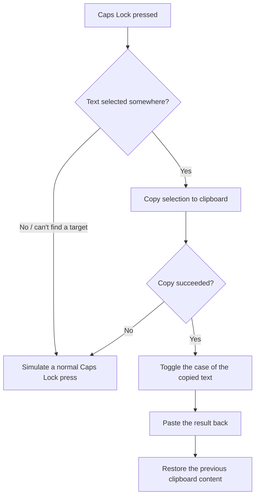

# LetterCaseToggle

<p align="center">
  
</p>

<p align="center"><b>
Select text anywhere and press <kbd>Caps Lock</kbd> to toggle its case —
without ever changing your keyboard's real Caps Lock state.
</b></p>

<p align="center">
  
  
  
  
  
</p>

A tiny background utility that lives entirely in the system tray. No windows,
no configuration — install it, forget it, and use Caps Lock as a case-toggle
shortcut for whatever text you've selected.

## How it works

Caps Lock is intercepted with a low-level Windows keyboard hook
(`WH_KEYBOARD_LL`), so the real key press never reaches the OS directly.

| Situation                                  | Result                                       |
|--------------------------------------------|----------------------------------------------|
| Text selected, contains a lowercase letter | Selection is replaced with **ALL CAPS**      |
| Text selected, no lowercase letters        | Selection is replaced with **all lowercase** |
| Nothing selected / no valid target window  | Caps Lock behaves normally (typing case toggles as usual) |

When there's a selection, the app copies it, transforms the case, pastes it
back, and restores whatever was previously on your clipboard — all within a
fraction of a second:



Because the real key event is swallowed by the hook, your keyboard's physical
Caps Lock indicator is never touched by this — the OS Caps Lock state
genuinely doesn't change unless the app itself simulates a press (the "normal
behavior" fallback above).

## Features

- Runs entirely from the system tray — no main window, no taskbar entry
- Preserves your clipboard contents (restored right after the toggle)
- Falls back gracefully to normal Caps Lock behavior when there's nothing to
  toggle, so typing in caps still works as expected
- Middle-click the tray icon, or use **Quit** from its context menu, to exit
- Never sends the simulated `Ctrl+C` / `Ctrl+V` into the app's own windows or
  console, even as a fallback path

## Requirements

- Windows
- [Qt 6](https://www.qt.io/download) — `Widgets` and `Core` modules
- CMake 3.28+
- A C++23-capable compiler (developed with MSVC / Visual Studio)

## Building

The project is CMake-based and opens directly in Visual Studio via
**File → Open → Folder** — no `.sln` file needed.

1. Make sure CMake can find your Qt 6 installation, e.g. by pointing
   `CMAKE_PREFIX_PATH` at it:
   ```
   -DCMAKE_PREFIX_PATH=C:/Qt/6.x.x/msvc2022_64
   ```
   (or configure this once via Visual Studio's CMake settings / presets)
2. Configure and build:
   ```
   cmake -B build -DCMAKE_PREFIX_PATH=C:/Qt/6.x.x/msvc2022_64
   cmake --build build --config Release
   ```

> Release builds are pure GUI apps with no console window. Debug builds keep
> a console attached, so `qDebug()` output is visible while developing.

The `LetterCaseToggle` target is set as the startup project.

## Project structure

```
LetterCaseToggle/
├── CMakeLists.txt           # Top-level project, wires up both subprojects
├── Dependencies.cmake       # Qt6 find_package()
│
├── LetterCaseToggle/        # Main executable
│   ├── CMakeLists.txt
│   ├── LetterCaseToggle.rc  # Embeds the app icon into the .exe itself
│   ├── Assets/
│   │   ├── appIcon.ico
│   │   └── assetFiles.qrc   # Qt resource file (tray icon)
│   └── Source/
│       ├── Main.cpp             # Entry point, installs the keyboard hook
│       ├── App.h / .cpp         # Tray icon, clipboard flow, HandleCaps()
│       └── SystemHook.h / .cpp  # Low-level hook + Win32 focus/input helpers
│
└── Core/                    # Static library, OS-independent logic
    ├── CMakeLists.txt
    └── Source/Core/
        └── TextTransform.h / .cpp  # ToggleCase() — the actual case-flip logic
```

## Architecture

- **`Core`** — a small static library with no Windows or Qt dependencies.
  Currently just `Core::ToggleCase()`, kept separate so the case-flipping
  logic stays easy to test or reuse on its own.
- **`LetterCaseToggle`** — the executable. Owns the tray icon (`App`), the
  Win32 keyboard hook and window-focus helpers (`SystemHook`), and wires them
  together in `Main.cpp`.

## Notes

- Windows-only (uses `<Windows.h>`, `SetWindowsHookEx`, `SendInput`, etc.)
- Some editors and IDEs (e.g. Visual Studio, VS Code) copy the entire current
  line via `Ctrl+C` when nothing is selected. In those apps, pressing Caps
  Lock without an actual selection may insert a copy of the current line
  (with its case toggled) next to your cursor, instead of falling back to a
  normal Caps Lock press.
- Still in development.

> **Disclaimer:** This software is provided "as is", without warranty of any
> kind. Use at your own risk — see the [License](#license) section for details.

## License

This project is licensed under the [GNU General Public License v3.0](https://www.gnu.org/licenses/gpl-3.0.html).
See `LICENSE` for the full text.
